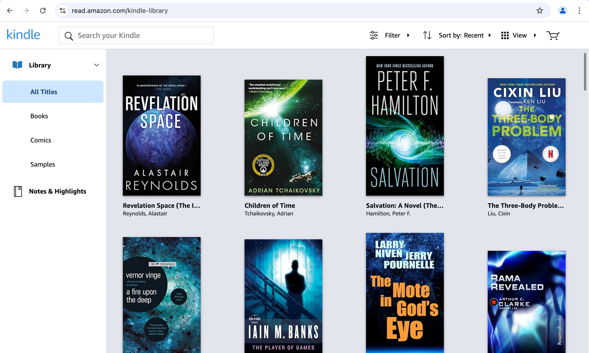
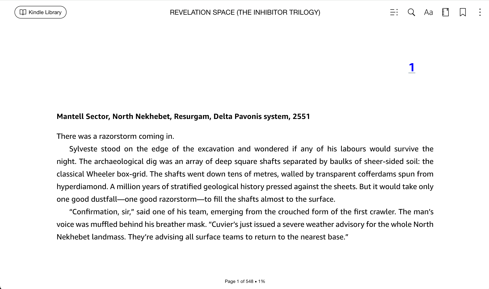
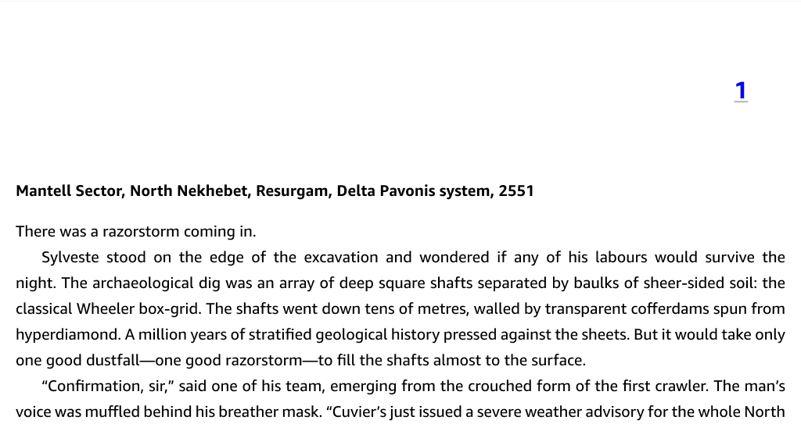

# kindle-ai-export <!-- omit from toc -->

> Export any Kindle book you own as text, PDF, EPUB, or as a custom, AI-narrated audiobook. 🔥

<p>
  <a href="https://github.com/transitive-bullshit/kindle-ai-export/actions/workflows/main.yml"></a>
  <a href="https://github.com/transitive-bullshit/kindle-ai-export/blob/main/license"></a>
  <a href="https://prettier.io"></a>
</p>

- [Intro](#intro)
  - [How does it work?](#how-does-it-work)
  - [Why is this necessary?](#why-is-this-necessary)
- [Usage](#usage)
  - [Setup Env Vars](#setup-env-vars)
  - [Extract Kindle Book](#extract-kindle-book)
  - [Transcribe Book Content](#transcribe-book-content)
  - [Export Book as PDF](#export-book-as-pdf)
  - [(Optional) Export Book as EPUB](#optional-export-book-as-epub)
- [Disclaimer](#disclaimer)
- [Author's Notes](#authors-notes)
  - [Alternative Approaches](#alternative-approaches)
- [How is the accuracy?](#how-is-the-accuracy)
- [Example](#example)
- [License](#license)

## Intro

This project makes it easy to export the contents of any ebook in your Kindle library as text, PDF, EPUB, or as a custom, AI-narrated audiobook. It only requires a valid Amazon Kindle account and an OpenAI API key.

_You must own the ebook on Kindle for this project to work._

The [examples directory](./examples/B0819W19WD) contains a preview export of the first page of the scifi book [Revelation Space](https://www.amazon.com/gp/product/B0819W19WD?ref_=dbs_m_mng_rwt_calw_tkin_0&storeType=ebooks) by [Alastair Reynolds](https://www.goodreads.com/author/show/51204.Alastair_Reynolds), including the [preview PDF output](./examples/B0819W19WD/book-preview.pdf).

### How does it work?

It works by logging into your [Kindle web reader](https://read.amazon.com) account using [Playwright](https://playwright.dev), exporting each page of a book as a PNG image, and then using a vLLM (`gpt-4o` or `gpt-4o-mini`) to transcribe the text from each page to text. Once we have the raw book contents and metadata, then it's easy to convert it to PDF, EPUB, etc. 🔥

This [example](./examples/B0819W19WD) uses the first page of the scifi book [Revelation Space](https://www.amazon.com/gp/product/B0819W19WD?ref_=dbs_m_mng_rwt_calw_tkin_0&storeType=ebooks) by [Alastair Reynolds](https://www.goodreads.com/author/show/51204.Alastair_Reynolds):

<table>
  <tbody>
    <tr>
      <td>
        The automated script starts from the Kindle web reader's library page and selects the book we want to export.
      </td>
      <td>
        
      </td>
    </tr>
    <tr>
      <td>
        We use Playwright to navigate to each page of the selected book.
      </td>
      <td>
        
      </td>
    </tr>
    <tr>
      <td>
        Playwright exports a PNG screenshot for each page, bypassing Kindle's DRM.
      </td>
      <td>
        
      </td>
    </tr>
    <tr>
      <td>
        Then we convert each page's screenshot into text using one of OpenAI's vLLMs (<strong>gpt-4o</strong> or <strong>gpt-4o-mini</strong>).
      </td>
      <td>
<p>Mantell Sector, North Nekhebet, Resurgam, Delta Pavonis system, 2551</p>

<p>There was a razorstorm coming in.</p>

<p>Sylveste stood on the edge of the excavation and wondered if any of his labours would survive the night. The archaeological dig was an array of deep square shafts separated by baulks of sheer-sided soil: the classical Wheeler box-grid. The shafts went down tens of metres, walled by transparent cofferdams spun from hyperdiamond. A million years of stratified geological history pressed against the sheets. But it would take only one good dustfall—one good razorstorm—to fill the shafts almost to the surface.</p>

<p>“Confirmation, sir,” said one of his team, emerging from the crouched form of the first crawler. The man’s voice was muffled behind his breather mask. “Cuvier’s just issued a severe weather advisory for the whole North</p>

</td>
</tr>
    <tr>
      <td>
        We now have full access to the book's contents and metadata, so we can export it in any format we want. 🎉
      </td>
      <td>
        <a href="./examples/B0819W19WD/book-preview.pdf">Preview of the PDF output</a> containing only the first page of the book for example purposes.
      </td>
    </tr>
  </tbody>
</table>

> [!NOTE] > _(Exporting audio books with AI-generated voice narration is coming soon! Please star the repo if you're interested in this feature.)_

### Why is this necessary?

**Kindle uses a [custom AZW3 format](https://en.wikipedia.org/wiki/Kindle_File_Format) which includes heavy DRM**, making it very difficult to access the contents of ebooks that you own. It is possible to [strip the DRM using existing tools](#alternative-approaches), but it's a pain in the ass, is very difficult to automate, and the "best" solution is expensive and not open source.

This project changes that.

_Why?_ Because I LOVE reading science fiction and my library lives on Kindle, but none of the content is _hackable_. The official Kindle apps are lagging behind in their AI features, so my goal with this project was to make it easy to build AI-powered experiments on top of my own Kindle library. In order to do that, I first needed a reliable way to export the contents of my Kindle books in a reasonable format.

I also created an [OSS TypeScript client for the unofficial Kindle API](https://github.com/transitive-bullshit/kindle-api), but I ended up only using some of the types and utils since Playwright + vLLMs allowed me to completely bypass their unofficial API and DRM. It also should be a lot less error-prone than using their unofficial API.

## Usage

Make sure you have `node >= 18` and [pnpm](https://pnpm.io) installed.

1. Clone this repo
2. Run `pnpm install`
3. Set up environment variables ([details](#setup-env-vars))
4. Run `src/extract-kindle-book.ts` ([details](#extract-kindle-book))
5. Run `src/transcribe-book-contents.ts` ([details](#transcribe-book-content))
6. Run `src/export-book-pdf.ts` ([details](#export-book-as-pdf))

### Setup Env Vars

Set up these environment variables in a local `.env`:

```sh
AMAZON_EMAIL=
AMAZON_PASSWORD=
ASIN=

OPENAI_API_KEY=
```

You can find your book's [ASIN](https://en.wikipedia.org/wiki/Amazon_Standard_Identification_Number) (Amazon ID) by visiting [read.amazon.com](https://read.amazon.com) and clicking on the book you want to export. The resulting URL will look like `https://read.amazon.com/?asin=B0819W19WD&ref_=kwl_kr_iv_rec_2`, with `B0819W19WD` being the ASIN in this case.

### Extract Kindle Book

Run `npx tsx src/extract-kindle-book.ts`

- **This takes a few minutes to run.**
- This logs into your [Amazon Kindle web reader](https://read.amazon.com) using headless Chrome ([Playwright](https://playwright.dev)). It can be pretty fun to watch it run, though, so feel free to tweak the script to use `headless: false` if you want to understand what it's doing or debug things.
- If your account requires 2FA, the terminal will request a code from you before proceeding.
- It uses a persistent browser session, so you should only have to auth once.
- Once logged in, it navigates to the web reader page for a specific book (`https://read.amazon.com/?asin=${ASIN}`).
- Then it changes the reader settings to use a single column and a sans-serif font.
- Then it extracts the book's table of contents.
- Then it goes through each page of the book's main contents and saves a PNG screenshot of the rendered content to `out/${asin}/pages/${index}-${page}.png`.
- Lastly, it resets the reader to the original position so your reading progress isn't affected.
- It also records some JSON metadata with the TOC, book title, author, product image, etc to `out/${asin}/metadata.json`.

> [!NOTE]
> I'm pretty sure Kindle's web reader uses WebGL at least in part to render the page contents, because the content pages failed to generate when running this on a VM ([Browserbase](https://www.browserbase.com)). So if you're getting blank or invalid page screenshots, that may be the reason.

### Transcribe Book Content

Run `npx tsx src/transcribe-book-content.ts`

- **This takes a few minutes to run.**
- This takes each of the page screenshots and runs them through a vLLM (`gpt-4o` or `gpt-4o-mini`) to extract the raw text content from each page of the book.
- It then stitches these text chunks together, taking into account chapter boundaries.
- The result is stored as JSON to `out/${asin}/content.json`.

### Export Book as PDF

Run `npx tsx src/export-book-pdf.ts` to export your book as a PDF.

- This should run almost instantly.
- It uses [PDFKit](https://github.com/foliojs/pdfkit) under the hood.
- It includes a valid table of contents for easy navigation.
- The result is stored to `out/${asin}/book.pdf`.

### (Optional) Export Book as EPUB

If you want, you can use [Calibre](https://calibre-ebook.com) to convert your book's PDF to the EPUB ebook format. On a Mac, you can install `calibre` using Homebrew (`brew install --cask calibre`).

```sh
# replace B0819W19WD with your book's ASIN
ebook-convert out/B0819W19WD/book.pdf out/B0819W19WD/book.epub --enable-heuristics
```

_([ebook-convert docs](https://manual.calibre-ebook.com/generated/en/ebook-convert.html))_

## Disclaimer

**This project is intended purely for personal and educational use only**. It is not endorsed or supported by Amazon / Kindle. By using this project, you agree to not hold the author or contributors responsible for any consequences resulting from its usage.

## Author's Notes

This project will only work on Kindle books which you have access to in your personal library. **Please do not share the resulting exports publicly** – _we need to make sure that our authors and artists get paid fairly for their work_!

With that being said, I also feel strongly that we should individually be able to use content that we own in whatever format best suits our personal needs, especially if that involves building cool, open source experiments for LLM-powered book augmentation, realtime narration, and other unique AI-powered UX ideas.

I expect that Amazon Kindle will eventually get around to supporting some modern LLM-based features at some point in the future, but [ain't nobody got time to wait around for that](https://youtu.be/waEC-8GFTP4?t=25).

### Alternative Approaches

If you want to explore other ways of exporting your personal ebooks from Kindle, [this article](https://www.digitaltrends.com/mobile/how-to-convert-kindle-to-pdf/) gives a great breakdown of the options available, including [Calibre](https://calibre-ebook.com) (FOSS) and [Epubor Ultimate](https://www.epubor.com/ultimate.html) (paid). Trying to use the most popular [free online converter](https://cloudconvert.com/azw3-to-pdf) will throw a DRM error.

Compared with these approaches, the approach used by this project is much easier to automate. It also retains metadata about Kindle's original sync positions which is very useful for cases where you'd like to interoperate with Kindle. E.g., be able to jump from reading a Kindle book to listening to an AI-generated narration on a walk and then jumping back to reading the Kindle book and having the sync positions "just work".

The main downside is that it's possible for some transcription errors to occur during the `image ⇒ text` step - which uses a multimodal LLM and is not 100% deterministic. In my testing, I've been remarkably surprised with how accurate the results are, but there are occasional issues mostly with differentiating whitespace between paragraphs versus soft section breaks. Note that both Calibre and Epubor also use heuristics to deal with things like spacing and dashes used by wordwrap, so the fidelity of the conversions will not be 100% one-to-one with the original Kindle version in any case.

The other downside is that the **LLM costs add up to a few dollars per book using `gpt-4o`** or **around 30 cents per book using `gpt-4o-mini`**. With LLM costs constantly decreasing and local vLLMs, this cost per book should be free or almost free soon. The screenshots are also really good quality with no extra content, so you could swap any other OCR solution for the vLLM-based `image ⇒ text` quite easily.

## How is the accuracy?

The accuracy has been very close to perfect in my testing, with the only discrepancies being occasional whitespace issues.

## Example

Here's an [example](./examples/B0819W19WD) using the first page of the scifi book [Revelation Space](https://www.amazon.com/gp/product/B0819W19WD?ref_=dbs_m_mng_rwt_calw_tkin_0&storeType=ebooks) by [Alastair Reynolds](https://www.goodreads.com/author/show/51204.Alastair_Reynolds):

<table>
  <tbody>
    <tr>
      <td>
        
      </td>
    </tr>
  </tbody>
</table>

This image gets converted to the following text using a vLLM:

```md
**Mantell Sector, North Nekhebet, Resurgam, Delta Pavonis system, 2551**

There was a razorstorm coming in.

Sylveste stood on the edge of the excavation and wondered if any of his labours would survive the night. The archaeological dig was an array of deep square shafts separated by baulks of sheer-sided soil: the classical Wheeler box-grid. The shafts went down tens of metres, walled by transparent cofferdams spun from hyperdiamond. A million years of stratified geological history pressed against the sheets. But it would take only one good dustfall—one good razorstorm—to fill the shafts almost to the surface.

“Confirmation, sir,” said one of his team, emerging from the crouched form of the first crawler. The man’s voice was muffled behind his breather mask. “Cuvier’s just issued a severe weather advisory for the whole North
```

We do this for every page of the book (accounting for chapters, metadata, and special cases), and then we can easily export the result.

The [examples folder](./examples/B0819W19WD) contains a **PREVIEW** of the first page of [Revelation Space](https://www.amazon.com/gp/product/B0819W19WD?ref_=dbs_m_mng_rwt_calw_tkin_0&storeType=ebooks) by [Alastair Reynolds](https://www.goodreads.com/author/show/51204.Alastair_Reynolds). (It only contains the first page because I wanted to respect the author's copyright, but this should be enough for you to get a feel for what the output looks like).

- [preview PDF output](./examples/B0819W19WD/book-preview.pdf)
- [preview EPUB output](./examples/B0819W19WD/book-preview.epub)

## License

MIT © [Travis Fischer](https://x.com/transitive_bs)

If you found this project interesting, [consider following me on Twitter](https://x.com/transitive_bs).
